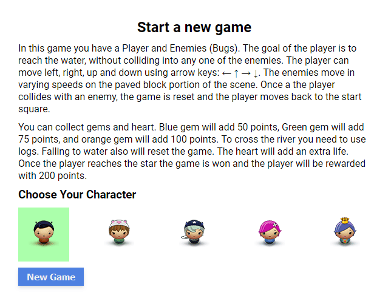
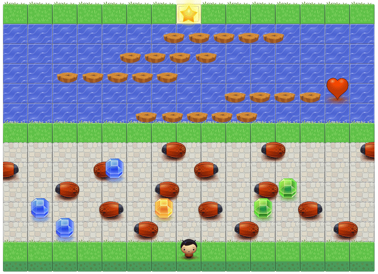

# Udacity Arcade Game clone &middot;    
> Learning project

In this game you have a Player and Enemies (Bugs). The goal of the player is to reach the water, without colliding into any one of the enemies. The player can move left, right, up and down using arrow keys:  ← ↑ → ↓. The enemies move in varying speeds on the paved block portion of the scene. Once a the player collides with an enemy, the game is reset and the player moves back to the start square.

You can collect gems and heart. Blue gem will add 50 points, Green gem will add 75 points, and orange gem will add 100 points. To cross the river you need to use logs. Falling to water also will reset the game. The heart will add an extra life. Once the player reaches the star the game is won and the player will be rewarded with 200 points.

## Installing / Getting started

No installation is needed. You can download the project and open index.html file in the root folder.
Or you can play it online on [Github Pages](https://soheevich.github.io/Udacity-Arcade-Game/)

### Built With
Gulp, SASS, ESlint.

### Prerequisites
What is needed to set up the dev environment. For instance, global dependencies or any other tools. include download links.